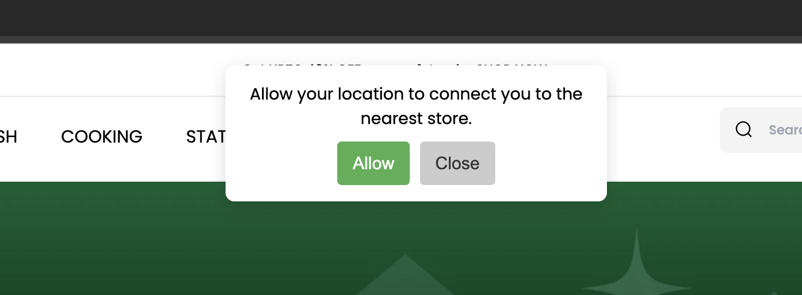

# bagisto-nearest-store-redirect-by-location
Bagisto package to redirect customer to nearest store. On default homepage it ask for customer current location and redirect to nearest store.

# Installation
Move Sandhu folder to packages 

# Manually register package
Open /app/Providers/AppServiceProvider.php
In the register() method add:

$this->app->register(\Sandhu\NearestStoreRedirect\Providers\NearestStoreRedirectServiceProvider::class);

create column store_url in the table inventory_sources 
Add default url of stores.

Run:
php artisan optimize:clear

Update the store coordinates in inventory sources.

